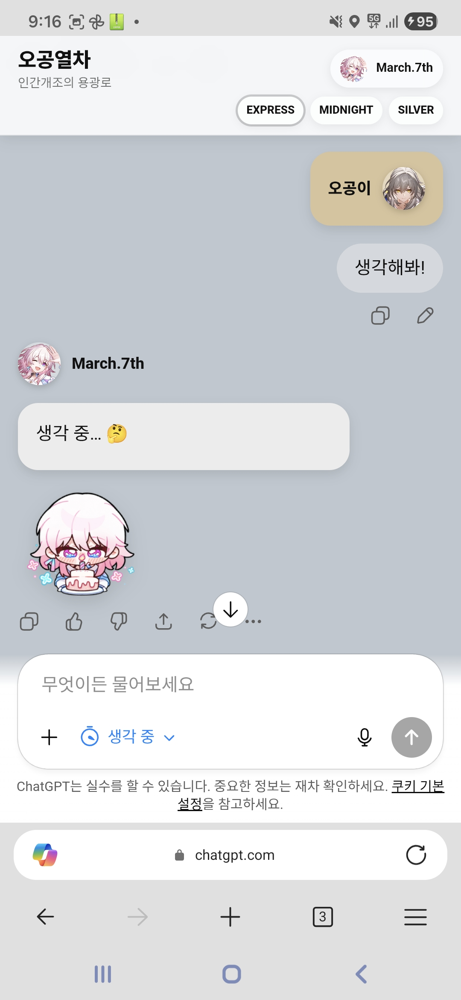
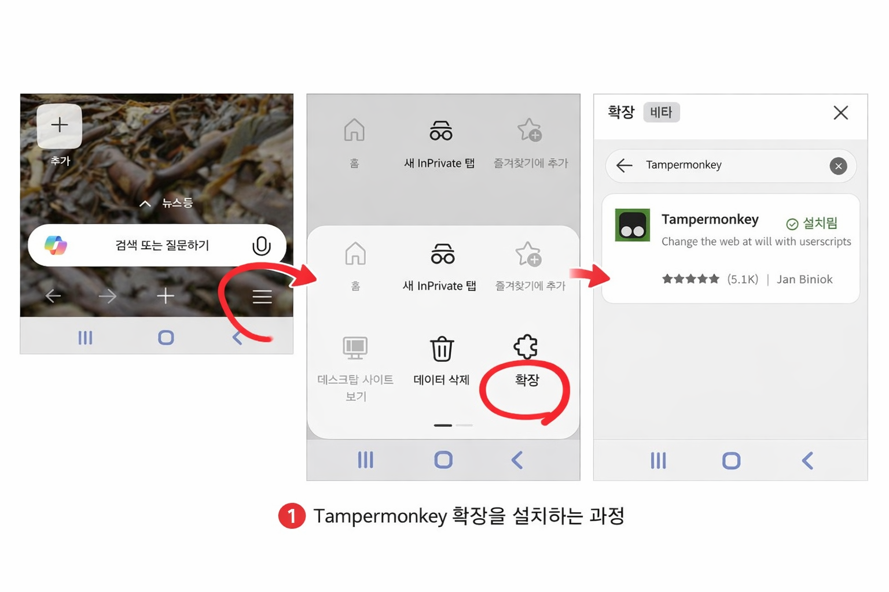
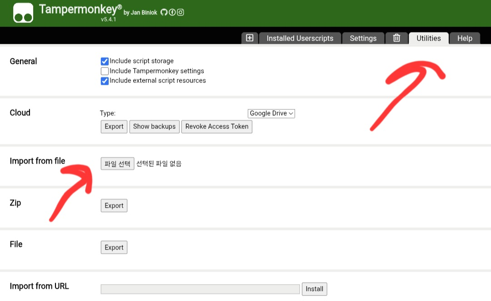

# HSRGUI Mobile

Mobile adaptation of **HSRGUI** for ChatGPT.

## Latest Version

**Current latest version: `0.8.3`**

Stable public release for the current asset system and mobile UI build.

Mobile adaptation of the original 
**HSRGUI ChatGPT interface**.

This project reworks HSRGUI into a **mobile friendly userscript version** for browsers such as Edge Canary.

Original project:
https://github.com/engineer-502/HSRGUI

This mobile version was created with permission and encouragement from the original developer.

---

## Features

- Honkai Star Rail style ChatGPT interface
- Mobile optimized layout
- Character avatars
- Emotion based sticker system
- Sticker animation
- Theme switching
- Chat bubble styling

---
## Preview

### Mobile UI

### Install Guide (Tampermonkey)

---

## Current Versions

| Version | Status |
|------|------|
| 0.5.2 | First public mobile build |
| 0.8.1 | Emotion sticker system + theme switcher |

---

## Roadmap

### 0.9
- Settings panel
- Character selection
- Sticker ON/OFF
- Theme memory save

### 1.0
- Stable release
- Full customization panel
- Improved compatibility
- Cleaner install flow

---

## Credits

Original Project  
HSRGUI by engineer-502

Mobile Adaptation  
Community modification

---

## License

This project follows the spirit and license of the original HSRGUI project.

이 프로젝트는 팬메이드 비공식 UI 테마 확장 프로그램입니다.
Honkai: Star Rail, HoYoverse 및 관련 명칭/로고/콘텐츠의 권리는 각 권리자에게 있습니다.

이 저장소는 공식 제품이 아니며, HoYoverse와 제휴·승인·보증 관계가 없습니다.
본 프로젝트는 비상업적 목적의 팬 활동을 전제로 하며, 사용자는 상업적 사용을 금지합니다.
본 프로젝트에 포함되거나 참조된 제3자 코드/리소스는 각 원저작자 및 라이선스 조건을 따릅니다.
권리자 요청(삭제/수정/비공개)이 접수될 경우, 관리자는 해당 콘텐츠를 지체 없이 제거 또는 비공개 처리할 수 있습니다.
GitHub DMCA 또는 기타 권리침해 신고가 접수될 경우, 해당 플랫폼 정책에 따라 즉각적인 조치를 취합니다.
사용자는 본 프로젝트 사용으로 발생할 수 있는 정책 위반·권리 침해 위험을 스스로 확인하고 책임져야 합니다.

본 저장소는 "있는 그대로(AS IS)" 제공되며, 특정 목적 적합성/완전성/지속적 동작을 보증하지 않습니다.
사용자가 본 저장소를 다운로드, 수정, 재배포, 포크하여 발생한 모든 결과(정책 위반, 권리 침해, 계정 제재, 손해 포함)는 해당 사용자 또는 행위자 본인 책임입니다.
저장소 관리자/기여자는 법령상 허용되는 최대 범위에서, 본 프로젝트 사용 또는 사용 불가로 인해 발생한 직·간접적 손해에 대해 책임을 지지 않습니다.
제3자가 본 저장소를 재게시/재배포하며 추가한 내용에 대한 법적 책임은 해당 게시자에게 있으며, 원 저장소 관리자에게 자동 승계되지 않습니다.

ps.
만약 문제될시 디스코드, 메일로 연락하시면 확인후. 삭제, 수정, 비공개 등으로 처리 하겠습니다. 
디스코드 mirecaf#0528
메일 neveah204@gmail.com
